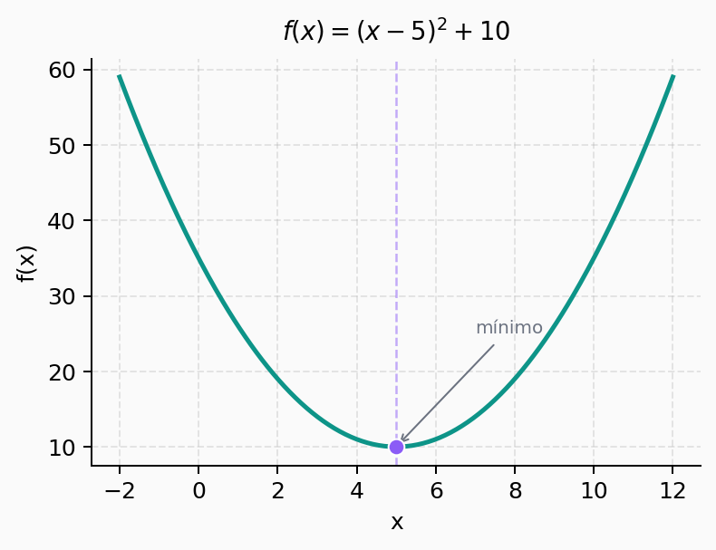
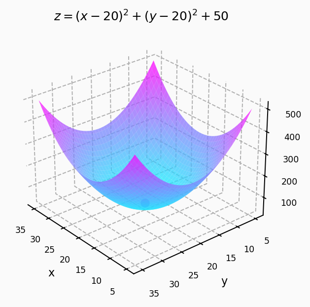

## Introdução

Vamos começar com alguns exemplos de funções, particularmente uma função quadrática no plano cartesiano e uma função
em três dimensões, que são dadas respectivamente por

$$
f(x) = (x - 5)^2 + 10
$$

e 

$$
z = (x - 20)^2 + (y-20)^2 + 50
$$

Abaixo temos os gráficos dessas funções:

::: {layout-ncol=2}
{#fig-2d}

{#fig-3d}
:::

Note que ambas são contínuas, suaves e convexas, ou seja, possuem um único mínimo global. O objetivo de um problema de otimização é encontrar o vetor $\mathbf{x}_{opt}$ que minimiza a função:

$$
\mathbf{x}_{opt} = \arg \min_{\mathbf{x}} f(\mathbf{x})
$$

Nas próximas seções vamos explorar duas formas de resolver esse problema: uma direta (analítica) e outra iterativa.

## Método Não-Iterativo

Quando a função é convexa, contínua e diferenciável, podemos encontrar o mínimo de forma direta: basta calcular o gradiente da função e igualá-lo a zero.

$$
\frac{\partial f(\mathbf{x})}{\partial \mathbf{x}} = \mathbf{0}
$$

Escrevendo em termos das componentes:

$$
\begin{bmatrix} \frac{\partial f}{\partial x_1} \\ \frac{\partial f}{\partial x_2} \\ \vdots \\ \frac{\partial f}{\partial x_p} \end{bmatrix} = \begin{bmatrix} 0 \\ 0 \\ \vdots \\ 0 \end{bmatrix}
$$

### Exemplo

Considerando o parabolóide $z = f(x,y) = (x-a)^2 + (y-b)^2 + c$, o vetor-gradiente é:

$$
\begin{bmatrix} \frac{\partial f}{\partial x} \\ \frac{\partial f}{\partial y} \end{bmatrix} = \begin{bmatrix} 2(x-a) \\ 2(y-b) \end{bmatrix}
$$

Igualando a zero:

$$
\begin{bmatrix} 2(x-a) \\ 2(y-b) \end{bmatrix} = \begin{bmatrix} 0 \\ 0 \end{bmatrix}
$$

De onde obtemos diretamente $\mathbf{x}_{opt} = [a \;\; b]^T$. Simples e direto, mas isso só funciona quando conseguimos resolver o sistema analiticamente.

## Método Iterativo: Gradiente Descendente

Em muitos problemas práticos não é possível obter uma solução fechada igualando o gradiente a zero. Nesses casos, usamos uma abordagem iterativa: o **gradiente descendente**.

A ideia central é simples: partimos de um ponto inicial qualquer e vamos "caminhando" na direção oposta ao gradiente (direção de maior decrescimento da função), dando passos proporcionais a uma taxa de aprendizagem $\alpha$.

A equação recursiva é:

$$
\mathbf{x}(n+1) = \mathbf{x}(n) - \alpha \frac{\partial f(\mathbf{x}(n))}{\partial \mathbf{x}(n)}
$$

onde:

- $\mathbf{x}(n)$ é o vetor-solução na iteração $n$
- $\alpha$ é o passo de adaptação (taxa de aprendizagem), com $0 < \alpha \ll 1$
- O sinal negativo garante que caminhamos na direção de **descida** da função

A interpretação é direta: a cada passo, o vetor-solução é ajustado na direção de máxima variação da função, com sinal negativo pois queremos minimizar. À medida que iteramos, a diferença $\|\mathbf{x}(n+1) - \mathbf{x}(n)\|$ vai diminuindo até que o gradiente se aproxima de zero, que é a condição de mínimo.

### Exemplo

Para a mesma função $z = (x-a)^2 + (y-b)^2 + c$, a regra de atualização fica:

$$
\begin{bmatrix} x(n+1) \\ y(n+1) \end{bmatrix} = \begin{bmatrix} x(n) \\ y(n) \end{bmatrix} - 2\alpha \begin{bmatrix} x(n) - a \\ y(n) - b \end{bmatrix}
$$

Com $a = b = 20$, $c = 50$, $\alpha = 0.1$, $x(0) = 2$ e $y(0) = 25$, as trajetórias convergem para os valores ótimos $x_{opt} = y_{opt} = 20$ após algumas iterações. Valores maiores de $\alpha$ aceleram a convergência, mas podem causar instabilidade se forem grandes demais.

### Funções convexas vs. não-convexas

- **Função convexa:** possui um único mínimo (global). O gradiente descendente converge para ele independente do ponto inicial.
- **Função não-convexa:** possui vários mínimos locais. O algoritmo converge para o mínimo mais próximo do ponto inicial $\mathbf{x}(0)$, que pode não ser o global.

> Essa limitação é uma das razões pelas quais a inicialização dos pesos em redes neurais é tão importante: a função custo de uma rede é altamente não-convexa.
