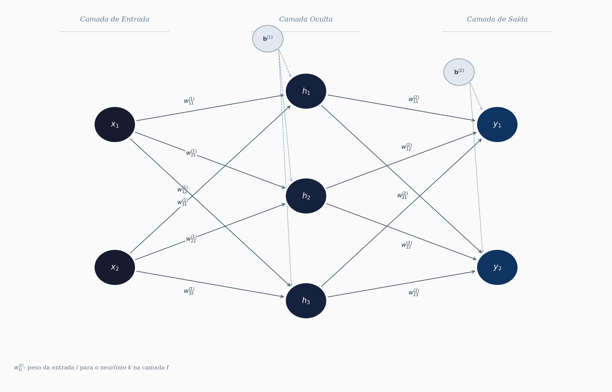
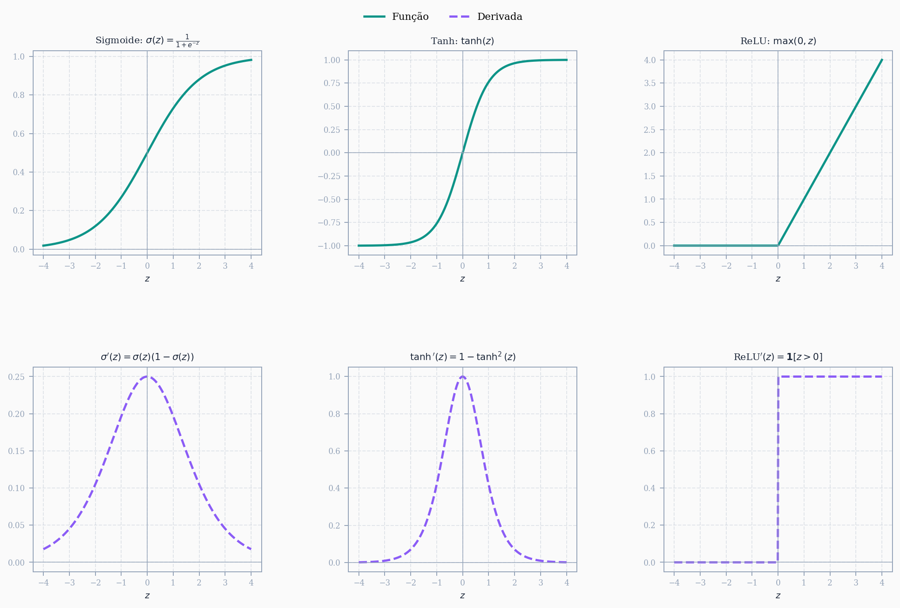

## Introdução

Redes neurais sempre me pareceram um daqueles temas que a gente visita várias vezes (forward pass, funções de ativação, neurônios, backpropagation) mas que só "clicam" de verdade quando paramos pra entender *por que* as coisas são feitas daquele jeito. No meu caso, o ponto que mais resistia era o backpropagation: por que derivadas parciais da função custo? Por que aquela cadeia toda de regras de derivação?

Decidi então construir o entendimento do zero, de forma incremental:

1. Primeiro, o conceito básico: o que é uma rede neural, sem formalismos pesados.
2. Depois, como minimizar uma função custo (a intuição por trás do gradiente).
3. Por fim, a forma matricial completa: forward pass, backpropagation e atualização de pesos.

Vou começar com uma rede de uma camada oculta para manter a didática simples, mas o objetivo é generalizar para um número qualquer de camadas e neurônios.

> **Pré-requisito:** alguma familiaridade com derivadas na forma matricial, já que vamos trabalhar diretamente com a representação matricial da rede.

## O que é uma rede neural: entradas, saídas, neurônios, camadas ocultas e funções de ativação

Uma rede neural é basicamente um modelo matemático que recebe um vetor de entrada $\mathbf{x} \in \mathbb{R}^p$ e produz um vetor de saída $\mathbf{y} \in \mathbb{R}^q$. Entre a entrada e a saída existem transformações sucessivas que envolvem operações lineares (multiplicação por matrizes de pesos) seguidas de funções não-lineares. É essa combinação que dá à rede a capacidade de aproximar relações complexas.

### Neurônio

O neurônio é a unidade fundamental. Ele recebe $p$ entradas, multiplica cada uma por um peso $w_j$, soma tudo (incluindo um termo de bias $b$) e aplica uma função de ativação $\varphi(\cdot)$:

$$
y = \varphi\left(\sum_{j=1}^{p} w_j x_j + b\right) = \varphi(\mathbf{w}^T \mathbf{x} + b)
$$

A parte $\mathbf{w}^T \mathbf{x} + b$ é chamada de ativação (ou pré-ativação). A função $\varphi$ introduz a não-linearidade que permite à rede modelar relações que vão além de combinações lineares.

### Camadas

Quando agrupamos vários neurônios que recebem as mesmas entradas, temos uma **camada**. Uma rede neural típica é organizada em:

- **Camada de entrada:** não faz processamento, apenas repassa os dados. Se temos $p$ variáveis de entrada, essa camada tem $p$ nós.
- **Camadas ocultas:** aqui acontece o processamento. Cada camada oculta tem $n_h$ neurônios que recebem as saídas da camada anterior, aplicam pesos + bias + ativação, e passam o resultado pra frente.
- **Camada de saída:** produz a resposta final da rede. Se queremos classificar em $q$ classes, teremos $q$ neurônios nessa camada.

Para uma rede com uma camada oculta de $n_h$ neurônios, as operações são:

$$
\mathbf{h} = \varphi(\mathbf{W}^{(1)} \mathbf{x} + \mathbf{b}^{(1)})
$$

$$
\mathbf{y} = \psi(\mathbf{W}^{(2)} \mathbf{h} + \mathbf{b}^{(2)})
$$

onde $\mathbf{W}^{(1)}$ é a matriz de pesos da primeira camada (dimensão $n_h \times p$), $\mathbf{W}^{(2)}$ é a da segunda (dimensão $q \times n_h$), e $\varphi$, $\psi$ são as funções de ativação de cada camada.

### Funções de ativação

A escolha da função de ativação importa bastante. As mais comuns são:

- **Sigmoide:** $\sigma(z) = \frac{1}{1 + e^{-z}}$, saída entre 0 e 1. Historicamente popular, mas sofre de gradientes que "somem" nas extremidades.
- **Tanh:** $\tanh(z) = \frac{e^z - e^{-z}}{e^z + e^{-z}}$, saída entre -1 e 1. Centrada em zero, o que ajuda no treinamento.
- **ReLU:** $\text{ReLU}(z) = \max(0, z)$. Simples, computacionalmente barata e resolve em parte o problema do gradiente que desaparece. É a mais usada em redes profundas hoje.
- **Softmax:** usada na camada de saída para problemas de classificação multiclasse. Transforma o vetor de ativações em probabilidades que somam 1.

### Por que funciona?

A intuição é a seguinte: cada camada da rede aplica uma transformação nos dados. A primeira camada pode aprender a detectar padrões simples (fronteiras lineares). A segunda combina esses padrões pra formar representações mais abstratas. E assim por diante. Existe inclusive um teorema (Universal Approximation Theorem) que garante que uma rede com pelo menos uma camada oculta e um número suficiente de neurônios pode aproximar qualquer função contínua num domínio compacto, dado que os pesos sejam ajustados corretamente.

O problema todo se resume a: como ajustar esses pesos? É aí que entram a função custo, o gradiente descendente e o backpropagation, que veremos nas próximas seções.

## Exemplo: rede com 1 camada oculta

Vamos tornar isso concreto. Considere uma rede com 2 entradas ($x_1, x_2$), 3 neurônios na camada oculta ($h_1, h_2, h_3$) e 2 saídas ($y_1, y_2$). A arquitetura fica assim:

{fig-align="center" width=90%}

### Forma matricial: camada oculta

O vetor de entrada é $\mathbf{x} = [x_1, x_2]^T$. A matriz de pesos da primeira camada $\mathbf{W}^{(1)}$ tem dimensão $3 \times 2$ (3 neurônios, 2 entradas) e o vetor de bias $\mathbf{b}^{(1)} \in \mathbb{R}^3$:

$$
\mathbf{W}^{(1)} = \begin{bmatrix} w_{11}^{(1)} & w_{12}^{(1)} \\ w_{21}^{(1)} & w_{22}^{(1)} \\ w_{31}^{(1)} & w_{32}^{(1)} \end{bmatrix}, \qquad \mathbf{b}^{(1)} = \begin{bmatrix} b_1^{(1)} \\ b_2^{(1)} \\ b_3^{(1)} \end{bmatrix}
$$

A pré-ativação da camada oculta é:

$$
\mathbf{W}^{(1)}\mathbf{x} + \mathbf{b}^{(1)} = \begin{bmatrix} w_{11}^{(1)} & w_{12}^{(1)} \\ w_{21}^{(1)} & w_{22}^{(1)} \\ w_{31}^{(1)} & w_{32}^{(1)} \end{bmatrix} \begin{bmatrix} x_1 \\ x_2 \end{bmatrix} + \begin{bmatrix} b_1^{(1)} \\ b_2^{(1)} \\ b_3^{(1)} \end{bmatrix} = \begin{bmatrix} w_{11}^{(1)}x_1 + w_{12}^{(1)}x_2 + b_1^{(1)} \\ w_{21}^{(1)}x_1 + w_{22}^{(1)}x_2 + b_2^{(1)} \\ w_{31}^{(1)}x_1 + w_{32}^{(1)}x_2 + b_3^{(1)} \end{bmatrix}
$$

Aplicando a função de ativação $\varphi$ elemento a elemento:

$$
\mathbf{h} = \varphi\!\left(\mathbf{W}^{(1)}\mathbf{x} + \mathbf{b}^{(1)}\right) = \begin{bmatrix} h_1 \\ h_2 \\ h_3 \end{bmatrix}
$$

### Forma matricial: camada de saída

Agora $\mathbf{h} \in \mathbb{R}^3$ é a entrada da segunda camada. A matriz de pesos $\mathbf{W}^{(2)}$ tem dimensão $2 \times 3$ e o bias $\mathbf{b}^{(2)} \in \mathbb{R}^2$:

$$
\mathbf{W}^{(2)} = \begin{bmatrix} w_{11}^{(2)} & w_{12}^{(2)} & w_{13}^{(2)} \\ w_{21}^{(2)} & w_{22}^{(2)} & w_{23}^{(2)} \end{bmatrix}, \qquad \mathbf{b}^{(2)} = \begin{bmatrix} b_1^{(2)} \\ b_2^{(2)} \end{bmatrix}
$$

A pré-ativação da camada de saída é:

$$
\mathbf{W}^{(2)}\mathbf{h} + \mathbf{b}^{(2)} = \begin{bmatrix} w_{11}^{(2)} & w_{12}^{(2)} & w_{13}^{(2)} \\ w_{21}^{(2)} & w_{22}^{(2)} & w_{23}^{(2)} \end{bmatrix} \begin{bmatrix} h_1 \\ h_2 \\ h_3 \end{bmatrix} + \begin{bmatrix} b_1^{(2)} \\ b_2^{(2)} \end{bmatrix} = \begin{bmatrix} w_{11}^{(2)}h_1 + w_{12}^{(2)}h_2 + w_{13}^{(2)}h_3 + b_1^{(2)} \\ w_{21}^{(2)}h_1 + w_{22}^{(2)}h_2 + w_{23}^{(2)}h_3 + b_2^{(2)} \end{bmatrix}
$$

Aplicando a função de ativação de saída $\psi$:

$$
\mathbf{y} = \psi\!\left(\mathbf{W}^{(2)}\mathbf{h} + \mathbf{b}^{(2)}\right) = \begin{bmatrix} y_1 \\ y_2 \end{bmatrix}
$$

### Resumo do forward pass

Juntando tudo, o fluxo completo de cálculo (forward pass) fica:

$$
\mathbf{x} \xrightarrow{\mathbf{W}^{(1)},\, \mathbf{b}^{(1)}} \mathbf{h} = \varphi\!\left(\mathbf{W}^{(1)}\mathbf{x} + \mathbf{b}^{(1)}\right) \xrightarrow{\mathbf{W}^{(2)},\, \mathbf{b}^{(2)}} \mathbf{y} = \psi\!\left(\mathbf{W}^{(2)}\mathbf{h} + \mathbf{b}^{(2)}\right)
$$

O total de parâmetros ajustáveis nessa rede é: $3 \times 2 + 3 + 2 \times 3 + 2 = 6 + 3 + 6 + 2 = 17$. Em redes profundas esse número cresce rapidamente, e é exatamente por isso que o backpropagation precisa ser eficiente.

## Dimensões das matrizes de pesos

Entender as dimensões é provavelmente a parte mais prática para quem vai implementar uma rede. Um erro de dimensão mata o código antes mesmo de começar a treinar, então vale fixar a regra geral.

Para uma camada $\ell$ qualquer, a regra é:

$$
\mathbf{W}^{(\ell)} \in \mathbb{R}^{n_\ell \times n_{\ell-1}}
$$

onde $n_{\ell-1}$ é o número de neurônios (ou entradas) da camada anterior e $n_\ell$ é o número de neurônios da camada atual. O bias sempre acompanha: $\mathbf{b}^{(\ell)} \in \mathbb{R}^{n_\ell}$.

A intuição é direta: cada linha de $\mathbf{W}^{(\ell)}$ contém os pesos de um neurônio da camada $\ell$, e esse neurônio precisa de um peso para cada entrada que recebe. Por isso o número de colunas é $n_{\ell-1}$.

### No nosso exemplo

| Camada | Operação | Dimensão de $\mathbf{W}^{(\ell)}$ | Dimensão de $\mathbf{b}^{(\ell)}$ | Dimensão da saída |
|--------|----------|-----------------------------------|-----------------------------------|-------------------|
| 1 (oculta) | $\mathbf{W}^{(1)}\mathbf{x} + \mathbf{b}^{(1)}$ | $3 \times 2$ | $3 \times 1$ | $\mathbf{h} \in \mathbb{R}^3$ |
| 2 (saída)  | $\mathbf{W}^{(2)}\mathbf{h} + \mathbf{b}^{(2)}$ | $2 \times 3$ | $2 \times 1$ | $\mathbf{y} \in \mathbb{R}^2$ |

Note que as dimensões se encaixam: o número de colunas de $\mathbf{W}^{(\ell)}$ tem que ser igual ao tamanho do vetor que entra. Se isso não bater, a multiplicação simplesmente não existe.

### Regra geral para $L$ camadas

Numa rede com $L$ camadas e arquitetura $[n_0, n_1, n_2, \ldots, n_L]$ (onde $n_0$ é o número de entradas e $n_L$ é o número de saídas), as dimensões ficam:

$$
\mathbf{W}^{(\ell)} \in \mathbb{R}^{n_\ell \times n_{\ell-1}}, \quad \mathbf{b}^{(\ell)} \in \mathbb{R}^{n_\ell}, \quad \ell = 1, 2, \ldots, L
$$

O total de parâmetros da rede é:

$$
\sum_{\ell=1}^{L} n_\ell \cdot (n_{\ell-1} + 1)
$$

O $+1$ vem do bias de cada camada. No nosso exemplo: $3 \cdot (2+1) + 2 \cdot (3+1) = 9 + 8 = 17$, que bate com o que calculamos antes.

Quando formos derivar o backpropagation, essas dimensões vão aparecer o tempo todo. O gradiente da função custo em relação a $\mathbf{W}^{(\ell)}$ precisa ter exatamente a mesma dimensão que $\mathbf{W}^{(\ell)}$, caso contrário a atualização dos pesos não faz sentido.

## Forward pass

O forward pass é simplesmente o caminho dos dados da entrada até a saída. Dado um vetor de entrada $\mathbf{x}$, calculamos a saída de cada camada em sequência, usando os pesos e biases atuais. Nenhum ajuste acontece aqui: é só propagar.

Para uma rede com $L$ camadas, o cálculo em cada camada $\ell$ segue dois passos:

**Passo 1 — pré-ativação:** combina linearmente as entradas com os pesos

$$
\mathbf{z}^{(\ell)} = \mathbf{W}^{(\ell)} \mathbf{a}^{(\ell-1)} + \mathbf{b}^{(\ell)}
$$

**Passo 2 — ativação:** aplica a função não-linear

$$
\mathbf{a}^{(\ell)} = \varphi^{(\ell)}\!\left(\mathbf{z}^{(\ell)}\right)
$$

onde adotamos $\mathbf{a}^{(0)} = \mathbf{x}$ (a entrada da rede). A saída final é $\hat{\mathbf{y}} = \mathbf{a}^{(L)}$.

Vale guardar explicitamente tanto $\mathbf{z}^{(\ell)}$ quanto $\mathbf{a}^{(\ell)}$ para cada camada durante esse passo. O motivo ficará claro no backpropagation: esses valores intermediários são necessários para calcular os gradientes.

### No nosso exemplo ($L = 2$)

Partindo de $\mathbf{a}^{(0)} = \mathbf{x} = [x_1,\, x_2]^T$:

**Camada 1 (oculta):**

$$
\mathbf{z}^{(1)} = \mathbf{W}^{(1)} \mathbf{x} + \mathbf{b}^{(1)} =
\begin{bmatrix}
w_{11}^{(1)} x_1 + w_{12}^{(1)} x_2 + b_1^{(1)} \\
w_{21}^{(1)} x_1 + w_{22}^{(1)} x_2 + b_2^{(1)} \\
w_{31}^{(1)} x_1 + w_{32}^{(1)} x_2 + b_3^{(1)}
\end{bmatrix}
\in \mathbb{R}^3
$$

$$
\mathbf{a}^{(1)} = \varphi\!\left(\mathbf{z}^{(1)}\right) =
\begin{bmatrix} \varphi(z_1^{(1)}) \\ \varphi(z_2^{(1)}) \\ \varphi(z_3^{(1)}) \end{bmatrix} = \mathbf{h} \in \mathbb{R}^3
$$

**Camada 2 (saída):**

$$
\mathbf{z}^{(2)} = \mathbf{W}^{(2)} \mathbf{a}^{(1)} + \mathbf{b}^{(2)} =
\begin{bmatrix}
w_{11}^{(2)} h_1 + w_{12}^{(2)} h_2 + w_{13}^{(2)} h_3 + b_1^{(2)} \\
w_{21}^{(2)} h_1 + w_{22}^{(2)} h_2 + w_{23}^{(2)} h_3 + b_2^{(2)}
\end{bmatrix}
\in \mathbb{R}^2
$$

$$
\hat{\mathbf{y}} = \mathbf{a}^{(2)} = \psi\!\left(\mathbf{z}^{(2)}\right) =
\begin{bmatrix} \psi(z_1^{(2)}) \\ \psi(z_2^{(2)}) \end{bmatrix} \in \mathbb{R}^2
$$

### Função custo

Com a saída $\hat{\mathbf{y}}$ em mãos, podemos medir o quão longe estamos da saída desejada $\mathbf{y}$. A função custo mais comum para regressão é o erro quadrático médio:

$$
\mathcal{L}(\mathbf{W}, \mathbf{b}) = \frac{1}{2} \|\hat{\mathbf{y}} - \mathbf{y}\|^2 = \frac{1}{2} \sum_{k=1}^{n_L} (\hat{y}_k - y_k)^2
$$

O fator $\frac{1}{2}$ é apenas conveniência: ele cancela o expoente 2 quando derivamos, deixando as expressões mais limpas. Para classificação multiclasse usa-se a entropia cruzada, mas o mecanismo do backpropagation é o mesmo.

O objetivo do treinamento é encontrar os pesos $\mathbf{W}^{(\ell)}$ e biases $\mathbf{b}^{(\ell)}$ que minimizam $\mathcal{L}$. Para isso precisamos calcular os gradientes de $\mathcal{L}$ em relação a cada parâmetro da rede, o que é exatamente o papel do backpropagation.

## Funções de ativação e suas derivadas

Antes de entrar no backpropagation, vale fixar as derivadas das principais funções de ativação. O motivo é direto: o backpropagation usa a regra da cadeia para propagar gradientes da saída para a entrada, e em cada camada essa derivação passa pela derivada de $\varphi^{(\ell)}$ em relação à pré-ativação $\mathbf{z}^{(\ell)}$. Se a derivada for zero em boa parte do domínio, o gradiente "some" e os pesos das primeiras camadas param de ser atualizados. Esse problema tem nome: *vanishing gradient*.

{fig-align="center" width=100%}

### Sigmoide

$$
\sigma(z) = \frac{1}{1 + e^{-z}}, \qquad \sigma'(z) = \sigma(z)\left(1 - \sigma(z)\right)
$$

Saída entre 0 e 1. A derivada é um resultado elegante: se você já calculou $\sigma(z)$ no forward pass, a derivada sai de graça. O problema é que $\sigma'(z)$ é pequena em quase todo o domínio, máxima em $z = 0$ com valor $0.25$. Em redes profundas, multiplicar muitos valores $\leq 0.25$ ao longo das camadas faz o gradiente cair exponencialmente, o que praticamente inviabiliza o treinamento das primeiras camadas.

### Tanh

$$
\tanh(z) = \frac{e^z - e^{-z}}{e^z + e^{-z}}, \qquad \tanh'(z) = 1 - \tanh^2(z)
$$

Saída entre $-1$ e $+1$, centrada em zero (o que ajuda a estabilizar o treinamento em relação à sigmoide). A derivada máxima é 1 em $z = 0$. Ainda sofre de vanishing gradient nas saturações, mas em geral converge melhor que a sigmoide em redes rasas.

### ReLU

$$
\text{ReLU}(z) = \max(0, z), \qquad \text{ReLU}'(z) = \begin{cases} 1, & z > 0 \\ 0, & z \leq 0 \end{cases}
$$

A mais usada em redes profundas hoje. A derivada é 1 para entradas positivas, o que evita o vanishing gradient nessa região. O lado negativo: neurônios com $z \leq 0$ têm gradiente zero e param de contribuir para o aprendizado (o chamado *dying ReLU*). Variantes como Leaky ReLU e ELU tentam contornar isso mantendo um pequeno gradiente para $z < 0$.

### Por que as derivadas importam no backpropagation

Quando calcularmos o gradiente de $\mathcal{L}$ em relação a $\mathbf{W}^{(\ell)}$, o resultado vai envolver o termo:

$$
\varphi'^{(\ell)}\!\left(\mathbf{z}^{(\ell)}\right)
$$

ou seja, a derivada da função de ativação avaliada nas pré-ativações que já calculamos no forward pass. É por isso que guardamos $\mathbf{z}^{(\ell)}$ durante o forward: precisamos dele exatamente aqui. A escolha da função de ativação muda diretamente a magnitude desse termo e, portanto, a velocidade e estabilidade do treinamento.

## Funções de saída

As funções de ativação discutidas acima são usadas nas camadas ocultas. A camada de saída é diferente: a função $\psi$ aplicada em $\mathbf{z}^{(L)}$ depende do tipo de problema que a rede resolve. A escolha errada aqui compromete tudo.

### Identidade (regressão)

$$
\psi(z) = z
$$

Quando a saída da rede é um valor real sem restrição de intervalo (prever temperatura, preço, etc.), a camada de saída não aplica nenhuma não-linearidade. A derivada é simplesmente 1, o que não interfere no gradiente.

### Sigmoide (classificação binária)

$$
\psi(z) = \sigma(z) = \frac{1}{1+e^{-z}}
$$

Usada quando a saída representa uma probabilidade de pertencer a uma de duas classes. A saída fica em $(0, 1)$ e é interpretada diretamente como $P(\text{classe} = 1 \mid \mathbf{x})$. Nesse caso a função custo natural é a entropia cruzada binária:

$$
\mathcal{L} = -\left[y \log \hat{y} + (1-y)\log(1-\hat{y})\right]
$$

### Softmax (classificação multiclasse)

Para $K$ classes, a softmax transforma o vetor de pré-ativações $\mathbf{z}^{(L)} \in \mathbb{R}^K$ num vetor de probabilidades que somam 1:

$$
\text{softmax}(\mathbf{z})_k = \frac{e^{z_k}}{\displaystyle\sum_{j=1}^{K} e^{z_j}}, \qquad k = 1, 2, \ldots, K
$$

A saída $\hat{y}_k$ representa a probabilidade estimada de a entrada pertencer à classe $k$. Duas propriedades importantes:

- $\hat{y}_k \in (0, 1)$ para todo $k$
- $\sum_{k=1}^{K} \hat{y}_k = 1$

A função custo natural para esse caso é a entropia cruzada categórica. Para um único exemplo com rótulo $y_k \in \{0, 1\}$ (codificação one-hot):

$$
\mathcal{L} = -\sum_{k=1}^{K} y_k \log \hat{y}_k
$$

Como $y_k = 1$ apenas para a classe correta e 0 para as demais, isso se reduz a $\mathcal{L} = -\log \hat{y}_{k^*}$, onde $k^*$ é a classe verdadeira. Minimizar $\mathcal{L}$ equivale a maximizar a probabilidade atribuída à classe correta.

Vale notar também um truque numérico importante: na prática, subtrai-se o máximo do vetor antes de exponenciar para evitar overflow:

$$
\text{softmax}(\mathbf{z})_k = \frac{e^{z_k - \max_j z_j}}{\displaystyle\sum_{j=1}^{K} e^{z_j - \max_j z_j}}
$$

O resultado matemático é idêntico, mas numericamente estável.

#### Derivada da softmax

A derivada da softmax é um pouco mais delicada que as anteriores porque a saída $\hat{y}_k$ depende de todas as componentes de $\mathbf{z}$, não só de $z_k$. Isso significa que precisamos de uma matriz jacobiana, não um simples escalar. Vou deixar esse subtópico para você desenvolver.

> *Derivação em breve...*

### Resumo: qual função usar na saída?

| Problema | Função de saída | Função custo |
|---|---|---|
| Regressão | Identidade | Erro quadrático médio |
| Classificação binária | Sigmoide | Entropia cruzada binária |
| Classificação multiclasse | Softmax | Entropia cruzada categórica |

## Backpropagation
