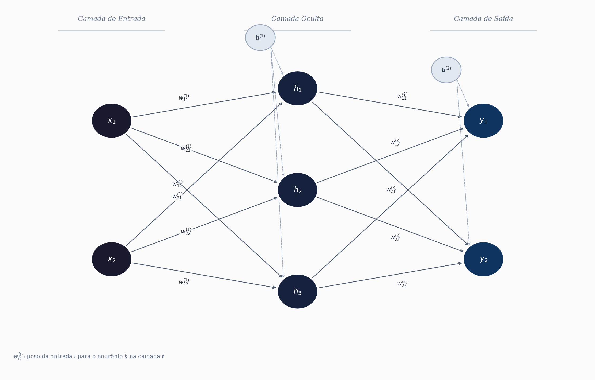
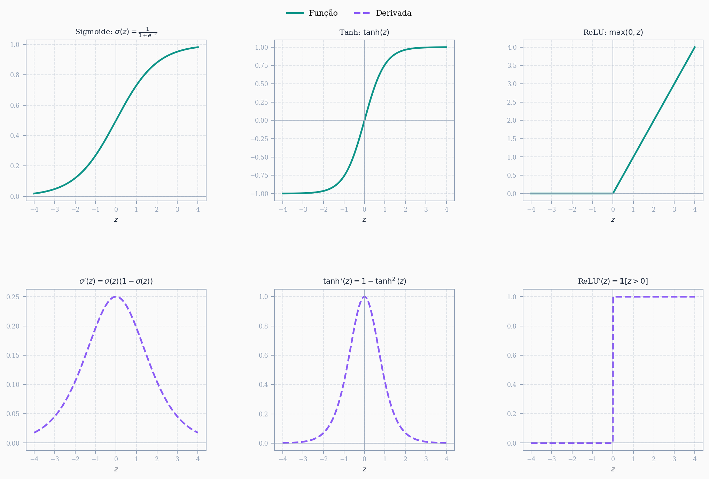

## Introdução

Redes neurais sempre me pareceram um daqueles temas que a gente visita várias vezes (forward pass, funções de ativação, neurônios, backpropagation) mas que só "clicam" de verdade quando paramos pra entender *por que* as coisas são feitas daquele jeito. No meu caso, o ponto que mais resistia era o backpropagation: por que derivadas parciais da função custo? Por que aquela cadeia toda de regras de derivação?

Decidi então construir o entendimento do zero, de forma incremental:

1. Primeiro, o conceito básico: o que é uma rede neural, sem formalismos pesados.
2. Depois, como minimizar uma função custo (a intuição por trás do gradiente).
3. Por fim, a forma matricial completa: forward pass, backpropagation e atualização de pesos.

Vou começar com uma rede de uma camada oculta para manter a didática simples, mas o objetivo é generalizar para um número qualquer de camadas e neurônios.

> **Pré-requisito:** alguma familiaridade com derivadas na forma matricial, já que vamos trabalhar diretamente com a representação matricial da rede.

## O que é uma rede neural: entradas, saídas, neurônios, camadas ocultas e funções de ativação

Uma rede neural é basicamente um modelo matemático que recebe um vetor de entrada $\mathbf{x} \in \mathbb{R}^p$ e produz um vetor de saída $\mathbf{y} \in \mathbb{R}^q$. Entre a entrada e a saída existem transformações sucessivas que envolvem operações lineares (multiplicação por matrizes de pesos) seguidas de funções não-lineares. É essa combinação que dá à rede a capacidade de aproximar relações complexas.

### Neurônio

O neurônio é a unidade fundamental. Ele recebe $p$ entradas, multiplica cada uma por um peso $w_j$, soma tudo (incluindo um termo de bias $b$) e aplica uma função de ativação $\phi(\cdot)$:

$$
y = \phi\left(\sum_{j=1}^{p} w_j x_j + b\right) = \phi(\mathbf{w}^T \mathbf{x} + b)
$$

A parte $\mathbf{w}^T \mathbf{x} + b$ é chamada de ativação (ou pré-ativação). A função $\phi$ introduz a não-linearidade que permite à rede modelar relações que vão além de combinações lineares.

### Camadas

Quando agrupamos vários neurônios que recebem as mesmas entradas, temos uma **camada**. Uma rede neural típica é organizada em:

- **Camada de entrada:** não faz processamento, apenas repassa os dados. Se temos $p$ variáveis de entrada, essa camada tem $p$ nós.
- **Camadas ocultas:** aqui acontece o processamento. Cada camada oculta tem $n_h$ neurônios que recebem as saídas da camada anterior, aplicam pesos + bias + ativação, e passam o resultado pra frente.
- **Camada de saída:** produz a resposta final da rede. Se queremos classificar em $q$ classes, teremos $q$ neurônios nessa camada.

Para uma rede com uma camada oculta de $n_h$ neurônios, as operações são:

$$
\mathbf{h} = \phi(\mathbf{x}\mathbf{W}_1 + \mathbf{b}_1)
$$

$$
\mathbf{y} = \gamma(\mathbf{h}\mathbf{W}_2 + \mathbf{b}_2)
$$

onde $\mathbf{W}_1$ é a matriz de pesos da primeira camada (dimensão $p \times n_h$), $\mathbf{W}_2$ é a da segunda (dimensão $n_h \times q$), e $\phi$, $\gamma$ são as funções de ativação de cada camada.

### Funções de ativação

A escolha da função de ativação importa bastante. As mais comuns são:

- **Sigmoide:** $\sigma(z) = \frac{1}{1 + e^{-z}}$, saída entre 0 e 1. Historicamente popular, mas sofre de gradientes que "somem" nas extremidades.
- **Tanh:** $\tanh(z) = \frac{e^z - e^{-z}}{e^z + e^{-z}}$, saída entre -1 e 1. Centrada em zero, o que ajuda no treinamento.
- **ReLU:** $\text{ReLU}(z) = \max(0, z)$. Simples, computacionalmente barata e resolve em parte o problema do gradiente que desaparece. É a mais usada em redes profundas hoje.
- **Softmax:** usada na camada de saída para problemas de classificação multiclasse. Transforma o vetor de ativações em probabilidades que somam 1.

### Por que funciona?

A intuição é a seguinte: cada camada da rede aplica uma transformação nos dados. A primeira camada pode aprender a detectar padrões simples (fronteiras lineares). A segunda combina esses padrões pra formar representações mais abstratas. E assim por diante. Existe inclusive um teorema (Universal Approximation Theorem) que garante que uma rede com pelo menos uma camada oculta e um número suficiente de neurônios pode aproximar qualquer função contínua num domínio compacto, dado que os pesos sejam ajustados corretamente.

O problema todo se resume a: como ajustar esses pesos? É aí que entram a função custo, o gradiente descendente e o backpropagation, que veremos nas próximas seções.

## Exemplo: rede com 1 camada oculta

Vamos tornar isso concreto. Considere uma rede com 2 entradas ($x_1, x_2$), 3 neurônios na camada oculta ($h_1, h_2, h_3$) e 2 saídas ($y_1, y_2$). A arquitetura fica assim:

{fig-align="center" width=90%}

### Forma matricial: camada oculta

O vetor de entrada (uma amostra em linha) é $\mathbf{x} = [x_1, x_2]$. A matriz de pesos da primeira camada $\mathbf{W}_1$ tem dimensão $2 \times 3$ (2 entradas, 3 neurônios) e o vetor de bias $\mathbf{b}_1 \in \mathbb{R}^{1 \times 3}$:

$$
\mathbf{W}_1 = \begin{bmatrix} w_{11}^{(1)} & w_{12}^{(1)} & w_{13}^{(1)} \\ w_{21}^{(1)} & w_{22}^{(1)} & w_{23}^{(1)} \end{bmatrix}, \qquad \mathbf{b}_1 = \begin{bmatrix} b_1^{(1)} & b_2^{(1)} & b_3^{(1)} \end{bmatrix}
$$

A pré-ativação da camada oculta é:

$$
\mathbf{x}\mathbf{W}_1 + \mathbf{b}_1 = \begin{bmatrix} x_1 & x_2 \end{bmatrix} \begin{bmatrix} w_{11}^{(1)} & w_{12}^{(1)} & w_{13}^{(1)} \\ w_{21}^{(1)} & w_{22}^{(1)} & w_{23}^{(1)} \end{bmatrix} + \begin{bmatrix} b_1^{(1)} & b_2^{(1)} & b_3^{(1)} \end{bmatrix} = \begin{bmatrix} w_{11}^{(1)}x_1 + w_{21}^{(1)}x_2 + b_1^{(1)} & w_{12}^{(1)}x_1 + w_{22}^{(1)}x_2 + b_2^{(1)} & w_{13}^{(1)}x_1 + w_{23}^{(1)}x_2 + b_3^{(1)} \end{bmatrix}
$$

Aplicando a função de ativação $\phi$ elemento a elemento:

$$
\mathbf{h} = \phi\!\left(\mathbf{x}\mathbf{W}_1 + \mathbf{b}_1\right) = \begin{bmatrix} h_1 & h_2 & h_3 \end{bmatrix}
$$

### Forma matricial: camada de saída

Agora $\mathbf{h} \in \mathbb{R}^{1 \times 3}$ é a entrada da segunda camada. A matriz de pesos $\mathbf{W}_2$ tem dimensão $3 \times 2$ e o bias $\mathbf{b}_2 \in \mathbb{R}^{1 \times 2}$:

$$
\mathbf{W}_2 = \begin{bmatrix} w_{11}^{(2)} & w_{12}^{(2)} \\ w_{21}^{(2)} & w_{22}^{(2)} \\ w_{31}^{(2)} & w_{32}^{(2)} \end{bmatrix}, \qquad \mathbf{b}_2 = \begin{bmatrix} b_1^{(2)} & b_2^{(2)} \end{bmatrix}
$$

A pré-ativação da camada de saída é:

$$
\mathbf{h}\mathbf{W}_2 + \mathbf{b}_2 = \begin{bmatrix} h_1 & h_2 & h_3 \end{bmatrix} \begin{bmatrix} w_{11}^{(2)} & w_{12}^{(2)} \\ w_{21}^{(2)} & w_{22}^{(2)} \\ w_{31}^{(2)} & w_{32}^{(2)} \end{bmatrix} + \begin{bmatrix} b_1^{(2)} & b_2^{(2)} \end{bmatrix} = \begin{bmatrix} w_{11}^{(2)}h_1 + w_{21}^{(2)}h_2 + w_{31}^{(2)}h_3 + b_1^{(2)} & w_{12}^{(2)}h_1 + w_{22}^{(2)}h_2 + w_{32}^{(2)}h_3 + b_2^{(2)} \end{bmatrix}
$$

Aplicando a função de ativação de saída $\gamma$:

$$
\mathbf{y} = \gamma\!\left(\mathbf{h}\mathbf{W}_2 + \mathbf{b}_2\right) = \begin{bmatrix} y_1 & y_2 \end{bmatrix}
$$

### Resumo do forward pass

Juntando tudo, o fluxo completo de cálculo (forward pass) fica:

$$
\mathbf{x} \xrightarrow{\mathbf{W}_1,\, \mathbf{b}_1} \mathbf{h} = \phi\!\left(\mathbf{x}\mathbf{W}_1 + \mathbf{b}_1\right) \xrightarrow{\mathbf{W}_2,\, \mathbf{b}_2} \mathbf{y} = \gamma\!\left(\mathbf{h}\mathbf{W}_2 + \mathbf{b}_2\right)
$$

O total de parâmetros ajustáveis nessa rede é: $3 \times 2 + 3 + 2 \times 3 + 2 = 6 + 3 + 6 + 2 = 17$. Em redes profundas esse número cresce rapidamente, e é exatamente por isso que o backpropagation precisa ser eficiente.

## Dimensões das matrizes de pesos

Entender as dimensões é provavelmente a parte mais prática para quem vai implementar uma rede. Um erro de dimensão mata o código antes mesmo de começar a treinar, então vale fixar a regra geral.

Para uma camada $\ell$ qualquer, a regra é:

$$
\mathbf{W}_\ell \in \mathbb{R}^{n_{\ell-1} \times n_\ell}
$$

onde $n_{\ell-1}$ é o número de neurônios (ou entradas) da camada anterior e $n_\ell$ é o número de neurônios da camada atual. O bias sempre acompanha: $\mathbf{b}_\ell \in \mathbb{R}^{1 \times n_\ell}$.

A intuição é direta: como os dados entram em linha ($\mathbf{a}_{\ell-1}\mathbf{W}_\ell$), cada coluna de $\mathbf{W}_\ell$ contém os pesos de um neurônio da camada $\ell$, e esse neurônio precisa de um peso para cada entrada que recebe. Por isso o número de linhas é $n_{\ell-1}$ e o de colunas é $n_\ell$.

### No nosso exemplo

| Camada | Operação | Dimensão de $\mathbf{W}_\ell$ | Dimensão de $\mathbf{b}_\ell$ | Dimensão da saída |
|--------|----------|-----------------------------------|-----------------------------------|-------------------|
| 1 (oculta) | $\mathbf{x}\mathbf{W}_1 + \mathbf{b}_1$ | $2 \times 3$ | $1 \times 3$ | $\mathbf{h} \in \mathbb{R}^{1 \times 3}$ |
| 2 (saída)  | $\mathbf{h}\mathbf{W}_2 + \mathbf{b}_2$ | $3 \times 2$ | $1 \times 2$ | $\mathbf{y} \in \mathbb{R}^{1 \times 2}$ |

Note que as dimensões se encaixam: o número de linhas de $\mathbf{W}_\ell$ tem que ser igual ao tamanho do vetor que entra. Se isso não bater, a multiplicação simplesmente não existe.

### Regra geral para $L$ camadas

Numa rede com $L$ camadas e arquitetura $[n_0, n_1, n_2, \ldots, n_L]$ (onde $n_0$ é o número de entradas e $n_L$ é o número de saídas), as dimensões ficam:

$$
\mathbf{W}_\ell \in \mathbb{R}^{n_{\ell-1} \times n_\ell}, \quad \mathbf{b}_\ell \in \mathbb{R}^{1 \times n_\ell}, \quad \ell = 1, 2, \ldots, L
$$

O total de parâmetros da rede é:

$$
\sum_{\ell=1}^{L} n_\ell \cdot (n_{\ell-1} + 1)
$$

O $+1$ vem do bias de cada camada. No nosso exemplo: $3 \cdot (2+1) + 2 \cdot (3+1) = 9 + 8 = 17$, que bate com o que calculamos antes.

Quando formos derivar o backpropagation, essas dimensões vão aparecer o tempo todo. O gradiente da função custo em relação a $\mathbf{W}_\ell$ precisa ter exatamente a mesma dimensão que $\mathbf{W}_\ell$, caso contrário a atualização dos pesos não faz sentido.

## Forward pass

O forward pass é simplesmente o caminho dos dados da entrada até a saída. Dado um vetor de entrada $\mathbf{x}$, calculamos a saída de cada camada em sequência, usando os pesos e biases atuais. Nenhum ajuste acontece aqui: é só propagar.

Para uma rede com $L$ camadas, o cálculo em cada camada $\ell$ segue dois passos:

**Passo 1 — pré-ativação:** combina linearmente as entradas com os pesos

$$
\mathbf{z}_\ell = \mathbf{a}_{\ell-1}\mathbf{W}_\ell + \mathbf{b}_\ell
$$

**Passo 2 — ativação:** aplica a função não-linear

$$
\mathbf{a}_\ell = \phi_\ell\!\left(\mathbf{z}_\ell\right)
$$

onde adotamos $\mathbf{a}_0 = \mathbf{x}$ (a entrada da rede). A saída final é $\hat{\mathbf{y}} = \mathbf{a}_L$.

Vale guardar explicitamente tanto $\mathbf{z}_\ell$ quanto $\mathbf{a}_\ell$ para cada camada durante esse passo. O motivo ficará claro no backpropagation: esses valores intermediários são necessários para calcular os gradientes.

### No nosso exemplo ($L = 2$)

Partindo de $\mathbf{a}_0 = \mathbf{x} = [x_1,\, x_2]$:

**Camada 1 (oculta):**

$$
\mathbf{z}_1 = \mathbf{x}\mathbf{W}_1 + \mathbf{b}_1 =
\begin{bmatrix}
w_{11}^{(1)} x_1 + w_{21}^{(1)} x_2 + b_1^{(1)} &
w_{12}^{(1)} x_1 + w_{22}^{(1)} x_2 + b_2^{(1)} &
w_{13}^{(1)} x_1 + w_{23}^{(1)} x_2 + b_3^{(1)}
\end{bmatrix}
\in \mathbb{R}^{1 \times 3}
$$

$$
\mathbf{a}_1 = \phi\!\left(\mathbf{z}_1\right) =
\begin{bmatrix} \phi(z_1^{(1)}) & \phi(z_2^{(1)}) & \phi(z_3^{(1)}) \end{bmatrix} = \mathbf{h} \in \mathbb{R}^{1 \times 3}
$$

**Camada 2 (saída):**

$$
\mathbf{z}_2 = \mathbf{a}_1\mathbf{W}_2 + \mathbf{b}_2 =
\begin{bmatrix}
w_{11}^{(2)} h_1 + w_{21}^{(2)} h_2 + w_{31}^{(2)} h_3 + b_1^{(2)} &
w_{12}^{(2)} h_1 + w_{22}^{(2)} h_2 + w_{32}^{(2)} h_3 + b_2^{(2)}
\end{bmatrix}
\in \mathbb{R}^{1 \times 2}
$$

$$
\hat{\mathbf{y}} = \mathbf{a}_2 = \gamma\!\left(\mathbf{z}_2\right) =
\begin{bmatrix} \gamma(z_1^{(2)}) & \gamma(z_2^{(2)}) \end{bmatrix} \in \mathbb{R}^{1 \times 2}
$$

### Função custo

Com a saída $\hat{\mathbf{y}}$ em mãos, podemos medir o quão longe estamos da saída desejada $\mathbf{y}$. A função custo mais comum para regressão é o erro quadrático médio:

$$
\mathcal{L}(\mathbf{W}, \mathbf{b}) = \frac{1}{2} \|\hat{\mathbf{y}} - \mathbf{y}\|^2 = \frac{1}{2} \sum_{k=1}^{n_L} (\hat{y}_k - y_k)^2
$$

O fator $\frac{1}{2}$ é apenas conveniência: ele cancela o expoente 2 quando derivamos, deixando as expressões mais limpas. Para classificação multiclasse usa-se a entropia cruzada, mas o mecanismo do backpropagation é o mesmo.

O objetivo do treinamento é encontrar os pesos $\mathbf{W}_\ell$ e biases $\mathbf{b}_\ell$ que minimizam $\mathcal{L}$. Para isso precisamos calcular os gradientes de $\mathcal{L}$ em relação a cada parâmetro da rede, o que é exatamente o papel do backpropagation.

## Funções de ativação e suas derivadas

Antes de entrar no backpropagation, vale fixar as derivadas das principais funções de ativação. O motivo é direto: o backpropagation usa a regra da cadeia para propagar gradientes da saída para a entrada, e em cada camada essa derivação passa pela derivada de $\phi_\ell$ em relação à pré-ativação $\mathbf{z}_\ell$. Se a derivada for zero em boa parte do domínio, o gradiente "some" e os pesos das primeiras camadas param de ser atualizados. Esse problema tem nome: *vanishing gradient*.

{fig-align="center" width=100%}

### Sigmoide

$$
\sigma(z) = \frac{1}{1 + e^{-z}}, \qquad \sigma'(z) = \sigma(z)\left(1 - \sigma(z)\right)
$$

Saída entre 0 e 1. A derivada é um resultado elegante: se você já calculou $\sigma(z)$ no forward pass, a derivada sai de graça. O problema é que $\sigma'(z)$ é pequena em quase todo o domínio, máxima em $z = 0$ com valor $0.25$. Em redes profundas, multiplicar muitos valores $\leq 0.25$ ao longo das camadas faz o gradiente cair exponencialmente, o que praticamente inviabiliza o treinamento das primeiras camadas.

### Tanh

$$
\tanh(z) = \frac{e^z - e^{-z}}{e^z + e^{-z}}, \qquad \tanh'(z) = 1 - \tanh^2(z)
$$

Saída entre $-1$ e $+1$, centrada em zero (o que ajuda a estabilizar o treinamento em relação à sigmoide). A derivada máxima é 1 em $z = 0$. Ainda sofre de vanishing gradient nas saturações, mas em geral converge melhor que a sigmoide em redes rasas.

### ReLU

$$
\text{ReLU}(z) = \max(0, z), \qquad \text{ReLU}'(z) = \begin{cases} 1, & z > 0 \\ 0, & z \leq 0 \end{cases}
$$

A mais usada em redes profundas hoje. A derivada é 1 para entradas positivas, o que evita o vanishing gradient nessa região. O lado negativo: neurônios com $z \leq 0$ têm gradiente zero e param de contribuir para o aprendizado (o chamado *dying ReLU*). Variantes como Leaky ReLU e ELU tentam contornar isso mantendo um pequeno gradiente para $z < 0$.

### Por que as derivadas importam no backpropagation

Quando calcularmos o gradiente de $\mathcal{L}$ em relação a $\mathbf{W}_\ell$, o resultado vai envolver o termo:

$$
\phi_\ell'\!\left(\mathbf{z}_\ell\right)
$$

ou seja, a derivada da função de ativação avaliada nas pré-ativações que já calculamos no forward pass. É por isso que guardamos $\mathbf{z}_\ell$ durante o forward: precisamos dele exatamente aqui. A escolha da função de ativação muda diretamente a magnitude desse termo e, portanto, a velocidade e estabilidade do treinamento.

## Funções de saída

As funções de ativação discutidas acima são usadas nas camadas ocultas. A camada de saída é diferente: a função $\gamma$ aplicada em $\mathbf{z}_L$ depende do tipo de problema que a rede resolve. A escolha errada aqui compromete tudo.

### Identidade (regressão)

$$
\gamma(z) = z
$$

Quando a saída da rede é um valor real sem restrição de intervalo (prever temperatura, preço, etc.), a camada de saída não aplica nenhuma não-linearidade. A derivada é simplesmente 1, o que não interfere no gradiente.

### Sigmoide (classificação binária)

$$
\gamma(z) = \sigma(z) = \frac{1}{1+e^{-z}}
$$

Usada quando a saída representa uma probabilidade de pertencer a uma de duas classes. A saída fica em $(0, 1)$ e é interpretada diretamente como $P(\text{classe} = 1 \mid \mathbf{x})$. Nesse caso a função custo natural é a entropia cruzada binária:

$$
\mathcal{L} = -\left[y \log \hat{y} + (1-y)\log(1-\hat{y})\right]
$$

### Softmax (classificação multiclasse)

Para $K$ classes, a softmax transforma o vetor de pré-ativações $\mathbf{z}_L \in \mathbb{R}^K$ num vetor de probabilidades que somam 1:

$$
\text{softmax}(\mathbf{z})_k = \frac{e^{z_k}}{\displaystyle\sum_{j=1}^{K} e^{z_j}}, \qquad k = 1, 2, \ldots, K
$$

A saída $\hat{y}_k$ representa a probabilidade estimada de a entrada pertencer à classe $k$. Duas propriedades importantes:

- $\hat{y}_k \in (0, 1)$ para todo $k$
- $\sum_{k=1}^{K} \hat{y}_k = 1$

A função custo natural para esse caso é a entropia cruzada categórica. Para um único exemplo com rótulo $y_k \in \{0, 1\}$ (codificação one-hot):

$$
\mathcal{L} = -\sum_{k=1}^{K} y_k \log \hat{y}_k
$$

Como $y_k = 1$ apenas para a classe correta e 0 para as demais, isso se reduz a $\mathcal{L} = -\log \hat{y}_{k^*}$, onde $k^*$ é a classe verdadeira. Minimizar $\mathcal{L}$ equivale a maximizar a probabilidade atribuída à classe correta.

Vale notar também um truque numérico importante: na prática, subtrai-se o máximo do vetor antes de exponenciar para evitar overflow:

$$
\text{softmax}(\mathbf{z})_k = \frac{e^{z_k - \max_j z_j}}{\displaystyle\sum_{j=1}^{K} e^{z_j - \max_j z_j}}
$$

O resultado matemático é idêntico, mas numericamente estável.

### Derivada da softmax

A derivada da softmax é um pouco mais delicada que as anteriores porque a saída $\hat{y}_k$ depende de todas as componentes de $\mathbf{z}$, não só de $z_k$. Isso significa que precisamos de uma matriz jacobiana, não um simples escalar. Seja então a função

$$
\text{softmax}(\mathbf{z})_k = \frac{e^{z_k}}{\sum_{j=1}^{n} e^{z_j}}, \quad \text{com } \text{softmax}: \mathbb{R}^n \to \mathbb{R}^n,
$$

isto é, uma função que recebe um vetor nos reais e retorna outro vetor nos reais. Vamos chamar de $D$ o somatório no denominador e abri-lo:

$$
D = \sum_{j=1}^{n} e^{z_j} = e^{z_1} + e^{z_2} + \ldots + e^{z_j} + \ldots + e^{z_n}.
$$

Desta maneira, temos que

$$
s_k = \frac{e^{z_k}}{D}.
$$

Para derivar podemos utilizar a regra da derivada quociente.

> **Relembre:** se $f$ e $g$ são funções contínuas e diferenciáveis, vale que
> $$\left(\frac{f}{g}\right)' = \frac{f'g - fg'}{g^2}$$

Queremos calcular $\dfrac{\partial s_k}{\partial z_j}$, ou seja, como a $k$-ésima saída varia quando mudamos a $j$-ésima entrada. Seja $f = e^{z_k}$ e $g = D$. Como estamos derivando em relação a $z_j$, temos dois casos:

**Caso 1: $j = k$** — o numerador depende de $z_j$, então $f' = e^{z_k}$. O denominador também depende, com $g' = e^{z_j} = e^{z_k}$.

**Caso 2: $j \neq k$** — o numerador não depende de $z_j$, então $f' = 0$. Apenas o denominador contribui, com $g' = e^{z_j}$.

Assim para o caso 1 ($j = k$) temos: 

$$
\frac{\partial s_k}{\partial z_k} = \frac{e^{z_k} D - (e^{z_k})^2}{D^2} = \frac{e^{z_k}}{D} - \Bigg(\frac{e^{z_k}}{D}\Bigg)^2
$$

Lembre que $s_k = e^{z_k} / D$ e portanto a derivada para o caso 1 é simplesmente $s_k(1 - s_k)$. 

Para o caso 2 (j \neq k) temos:

$$
\frac{\partial s_k}{\partial z_j} = \frac{0 \times D - e^{z_k} e^{z_j}}{D^2} = -\frac{e^{z_k}}{D} \frac{e^{z_j}}{D} = -s_k \times s_j. 
$$

Podemos unir os dois casos de forma compacta 

$$
\frac{\partial s_k}{\partial z_j} = \begin{cases} s_k(1 - s_k), \,\, &j = k  \\ 
-s_k \times s_j, \,\, &j \neq k\end{cases}
$$

que pode ser reescrita em termos da funççao delta de Kronecker 
($\delta_{kj} = 1$ se $k=j$, 0 caso contrário):

$$
\frac{\partial s_k}{ \partial z_j} = s_k(\delta_{kj} - s_j). 
$$

Podemos vizualizar essa derivada como uma matriz jacobiana com derivadas parciais em que os 
termos da diagonal principal são os termos $j = k$ e os elementos fora da diagonal são os termos
$j \neq k$:

$$
\frac{\partial \mathbf{s}}{\partial \mathbf{z}} = 
\begin{pmatrix}
s_1(1-s_1) & -s_1 s_2   & \cdots & -s_1 s_n   \\
-s_2 s_1   & s_2(1-s_2) & \cdots & -s_2 s_n   \\
\vdots     & \vdots     & \ddots & \vdots     \\
-s_n s_1   & -s_n s_2   & \cdots & s_n(1-s_n)
\end{pmatrix}
$$

---

### Segunda maneira de obter a derivada

Outra maneira interessante de obter essa derivada seria começar por  

$$
\frac{\partial}{\partial z_j} \log(s_k) = \frac{1}{s_k} \underbrace{\frac{\partial s_k}{\partial z_j}}_\text{queremos isso} \,\,\, 
$$

Note que apenas aplicamos a definição da derivada da função $\log(x)$ (aqui é o logaritmo natural, só pra gente saber). Multiplicando ambos
os lados da igualdade acima por $s_k$ temos

$$
\frac{\partial s_k}{\partial z_j} = s_k \frac{\partial}{\partial z_j} \log(s_k), 
$${#eq-deriv_logsk}

mas vamos lembrar que $\log(s_k) = \log(\exp(z_k) / D)$ e pela propriedade do logaritmo da divisão temos

\begin{align}
\log(s_k) &= \log(e^{z_k}) - \log(D) \\
&= z_k - \log(D). 
\end{align} 

Então, substituindo esse resultado na Eq. ([-@eq-deriv_logsk]), a derivada desse logaritmo fica da seguinte maneira: 

$$
\frac{\partial}{\partial z_j} \log(s_k) = \frac{\partial z_k}{\partial z_j} - \frac{\partial}{\partial z_j} \log(D).
$${#eq-derivlogzj}

Note que o primeiro termo da igualdade na Eq. ([-@eq-derivlogzj]) é a derivada de uma constante, que será 1 se $k = j$ e 0 se $k \neq j$
essencialmente, uma função indicadora $\mathbb{I}(.)$. Já para o segundo termo da igualdade, aplicamos a derivada do logaritmo: 

$$
\frac{\partial}{\partial z_j} \log(D) = \frac{1}{D} \frac{\partial}{\partial z_j} D.  
$$

Vamos lembrar que essa derivada parcial de $D$ em relação ao termo $z_j$ é exatamente $e^{z_j}$, pois os outros termos da soma
são nulos nas derivadas. Portanto, a Eq. ([-@eq-derivlogzj]) torna-se 

$$
\frac{\partial}{\partial z_j} \log(s_k) = \mathbb{I}(k=j) - \underbrace{\frac{e^{z_j}}{D}}_{s_j} = \mathbb{I}(k=j) - s_j. 
$${#eq-derivadacompleta}

Finalmente, podemos substituir o resultado obtido em ([-@eq-derivadacompleta]) na Eq. ([-@eq-deriv_logsk]), obtendo 

$$
\frac{\partial s_k}{z_j} = s_k\{\mathbb{I}(k=j) - s_j\}. 
$$

Assim, obtemos os termos $s_k(1-s_k)$ para $k=j$ e os termos $-s_k \times s_j$ para $k \neq j$, que é exatamente a mesma
estrutura da matriz jacobiana de derivadas parciais já obtida. 

### Resumo: qual função usar na saída?

| Problema | Função de saída | Função custo |
|---|---|---|
| Regressão | Identidade | Erro quadrático médio |
| Classificação binária | Sigmoide | Entropia cruzada binária |
| Classificação multiclasse | Softmax | Entropia cruzada categórica |

## Backpropagation

Para obter a previsão final da rede neural, costuma-se aplicar a última
função de ativação sobre $\mathbf{z}_2$, geralmente a *softmax* para classificação 
multiclasses e linear para regressão. Vamos recapitular as expressões envolvidas 
numa rede neural com uma camada oculta. Temos 

$$
\mathbf{z}_1 = \mathbf{X}\mathbf{W}_1 + \mathbf{b}_1, 
$$

em que 

- $\mathbf{X}$: matriz de entrada (features) de dimensão $m \times n$. 
- $\mathbf{W}_1$: matriz de pesos da primeira camada. Se a camada oculta 
tem $h$ neurônios, $\mathbf{W}_1$ deverá ter dimensão $n \times h$. 
- $\mathbf{b}_1$: viés (bias) da primeira camada com dimensão ($1 \times h$). 
Soma-se a $\mathbf{X}\mathbf{W}_1$. 
- $\mathbf{z}_1$: combinação linear resultante (entrada da camada oculta) com
dimensão $m \times h$: 

$$
\mathbf{a}_1 = \phi(\mathbf{z}_1)
$$

em que $\mathbf{a}_1$ é a matriz (elemento a elemento) de ativações da primeira camada e $\phi$ é a função 
de ativação não-linear (ou linear) como vimos antes (ReLU, sigmóide logística,
tangente hiperbólica dentre outras). Isso tudo para a primeira camada. Já na segunda camada 
temos: 

$$
\mathbf{z}_2 = \mathbf{a}_1 \mathbf{W}_2 + \mathbf{b}_2, 
$$

com 

$$
\mathbf{a}_2 = \gamma(\mathbf{z}_2), 
$$

em que 

- $\mathbf{a}_1$: agora faz o papel de saída da camada anterior servindo como 
entrada da segunda camada oculta. 
- $\mathbf{z}_2$: pré-ativação (combinação linear) da segunda camada (camada de saída). 
- $\mathbf{W}_2$: matriz de pesos da segunda camada oculta (camada de saída da rede). 
Se existir $k$ neurônios de saída (por exemplo, $k$ classes de saída em probabilidade
de classificação) as dimensões de $\mathbf{W}_2$ serão exatamente $h \times k$. 
- $\mathbf{b}_2$: viés da segunda camada oculta (saída) com dimensão $1 \times k$.
- $\mathbf{a}_2$: ativação da segunda camada (saída final da rede) com dimensão $m \times k$.

De modo geral, temos uma grande função composta para a predição final da 
rede $\widehat{Y}$: 

$$
\widehat{Y} = \mathbf{a}_2 = \gamma\!\big(\phi(\mathbf{X}\mathbf{W}_1 + \mathbf{b}_1)\,\mathbf{W}_2 + \mathbf{b}_2\big).
$$

### Cálculo dos gradientes de $\mathbf{W}_1$ e $\mathbf{W}_2$

Vamos começar definindo uma função custo genérica (que recebe a saída linear $\mathbf{z}_2$
e os valores/rótulos reais $\mathbf{y}$). Começamos calculando o gradiente de saída, que é a 
derivada inicial do erro em relação à última saída linear: 

$$
\delta_2 = \frac{\partial C}{\partial z_2}. 
$$

Mas veja que $\mathbf{z}_2$ está relcionada com $\mathbf{a}_2$ através da relação $\mathbf{a}_2 = \gamma(\mathbf{z}_2)$. 
Pela regra da cadeia, 

$$
\delta_2 = \frac{\partial C}{\partial z_2} = \frac{\partial C}{\partial \mathbf{a}_2}\frac{\partial \mathbf{a}_2}{\partial \mathbf{z}_2}.
$${#eq-derivada-parcial-delta2}

Essa função custo que denotamos de $C$ pode ocorrer em situações de regressão: 

$$
C = \text{MSE} = \frac{1}{2}\|\widehat{\mathbf{y}} - \mathbf{y}\|^2, 
$$

ou em situação de classificação: 

$$
C = -[\mathbf{y} \log(\widehat{\mathbf{y}}) + (1-\mathbf{y}) \log(1 - \widehat{\mathbf{y}})]. 
$$

Precisamos fixar uma ideia central: tudo, absolutamente tudo nesta etapa deve começar 
na função custo. Mas porque estamos no sentido inverso da rede, a qual chamamos
backpropagation ? Propaga-se o que ? Qual o objetivo disso ? 

O principal objetivo é responder às perguntas: o que acontece com a função 
custo se os pesos $\mathbf{W}_1$ e $\mathbf{W}_2$ ou os vetores de viés $\mathbf{b}_1$ e $\mathbf{b}_2$
mudarem mesmo que de forma mínima ? Ela aumenta, diminui, se mantém do mesmo jeito ?. Note que perguntar
isso remete à noção de variações nessas quantidades e no quanto isso impacta na função 
custo, que geralmente queremos que tenha menor valor possível, pois implica num modelo 
mais acurado/preciso. Isso também nos faz lembrar da noção de derivadas parciais. 

Lembre que no nosso exemplo com 1 camada oculta, a previsão da rede $\widehat{\mathbf{y}}$ é a própria 
ativação final $\mathbf{a}_2 = \widehat{\mathbf{y}}$. Calculando cada termo separadamente: 

1. Derivada da função custo em relação à $\mathbf{a}_2$: 

  $$
  C = \frac{1}{2}(\mathbf{a}_2 - \mathbf{y})^2 \implies \frac{\partial C}{\partial \mathbf{a}_2} = \mathbf{a}_2 - \mathbf{y} = (\widehat{\mathbf{y}} - \mathbf{y}).  
  $$

2. Derivada da ativação em relação à $\mathbf{z}_2$:

  $$\mathbf{a}_2 = \gamma(\mathbf{z}_2) \implies \frac{\partial \mathbf{a}_2}{\partial \mathbf{z}_2} = \gamma'(\mathbf{z}_2).$$ 
  Substituindo os dois termos:

  $$
  \delta_2 =  (\widehat{\mathbf{y}} - \mathbf{y}) \odot \gamma'(\mathbf{z}_2), 
  $$

  em que $\odot$ denota o produto de Hadamard (produto elemento a elemento). As escolhas comuns aqui pra 
  função de ativação são:

- Ativação Linear / Identidade $\gamma(z) = z$:

  Como $\gamma'(\mathbf{z}_2) = \mathbf{1}$ (vetor de uns), o gradiente se reduz simplesmente ao resíduo 

  $$
  \delta_2 = \widehat{\mathbf{y}} - \mathbf{y}. 
  $$

- ReLU:

  Aqui o resutado é um vetor binário de 0's e 1's: 

  $$
  \gamma'(\mathbf{z}_2)_{j} = \begin{cases}
  1, \,\,\, \text{se} \,\,\, z_{j} > 0 \\ 
  0, \,\,\, \text{se} \,\,\, z_{j} \leq 0
  \end{cases}
  $$

- Ativação sigmoide $\gamma(z) = \sigma(z)$:
  
  Temos $\gamma'(\mathbf{z}_2) = \sigma(\mathbf{z}_2) \odot (1 - \sigma(\mathbf{z}_2)) = \mathbf{a}_2 \odot (1 - 
  \mathbf{a}_2).$

- Ativação tangente hiperbólica: 

  $$
  \gamma'(\mathbf{z}_2) = \mathbf{1} - \tanh^{\odot 2}(\mathbf{z}_2) = \mathbf{1} - \mathbf{a}_2^{\odot 2}.
  $$

Note que o processo de obtenção do gradiente de saída também resulta ali no primeiro termo da derivada 
parcial em ([-@eq-derivada-parcial-delta2]) exatamente como se fosse no problema de regressão. Como o modelo 
foi definido na forma matricial (considerando um lote de $m$ exemplos), $\mathbf{y}$ e $\mathbf{a}_2$ 
são vetores de dimensão $m \times 1$. Por isso, as operações de multiplicação e divisão abaixo devem ocorrer 
elemento a elemento ($\odot$ denota o produto de Hadamard):

$$
\begin{align}
\frac{\partial C}{\partial \mathbf{a}_2} \Bigg(-[\mathbf{y} \odot \log(\mathbf{a}_2) + (1-\mathbf{y}) \odot \log(1 - \mathbf{a}_2)]\Bigg) &= 
-\Bigg[\frac{\mathbf{y}}{\mathbf{a}_2} + (1 - \mathbf{y}) \odot \frac{(-1)}{1 - \mathbf{a}_2}\Bigg] = \\
\frac{\mathbf{a}_2 - \mathbf{y}}{\mathbf{a}_2 \odot (1 - \mathbf{a}_2)}.
\end{align}
$$

Agora partimos pra obter a segunda parte da derivada:

$$
\frac{\partial \mathbf{a}_2}{\partial \mathbf{z}_2} = \gamma'(\mathbf{z}_2) = \sigma(\mathbf{z}_2) \odot \big(\mathbf{1} - \sigma(\mathbf{z}_2)\big) = \mathbf{a}_2 \odot (1 - \mathbf{a}_2).
$$

> Essas propriedades das derivadas das principais derivadas das funções de ativação vão ser abordadas em outro post dedicado. 

Assim temos que a derivada parcial da função custo em relação à pré-ativação da segunda camada (a saída linear) é dada por:

$$
\delta_2 = \frac{\partial C}{\partial \mathbf{z}_2} = \Bigg(\frac{\mathbf{a}_2 - \mathbf{y}}{\mathbf{a}_2 \odot (1 - \mathbf{a}_2)} \Bigg) \odot \Bigg( \mathbf{a}_2 \odot (1 - \mathbf{a}_2) \Bigg) = \mathbf{a}_2 - \mathbf{y} = \widehat{\mathbf{y}} - \mathbf{y}.
$$

Observe que utilizando a função de ativação sigmóide logística, temos que também se reduz ao resíduo (estimado - real). A lógica 
funciona perfeitamente igual para qualquer ativação que se queira colocar aqui. Se utilizássemos a saída multiclasses (softmax) teríamos 
aquela matriz jacobiana que obtemos anteriormente. 

### Gradiente da matriz de pesos $\mathbf{W}_2$

Para obter o gradiente de $W_2$ em relação a $C$, precisamos aplicar a regra da cadeia imaginando que todas essas coisas 
estão "aninhadas" dependentes umas das outras. Aqui você pode mentalizar o seguinte: para chegar em $\mathbf{W}_2$ eu tenho que fazer
qual sentido de volta na rede ? Lembramos então que $\mathbf{W}_2$ age sobre $\mathbf{a}_1$ para produzir $\mathbf{z}_2$, ou seja, nós temos 

$$
\mathbf{z}_2 = \mathbf{a}_1 \mathbf{W}_2 + \mathbf{b}_2,
$$

e $\mathbf{z}_2$ age sobre $\gamma$ que resulta em $\mathbf{a}_2$, então temos

$$
\mathbf{a}_2 = \gamma(\mathbf{z}_2), 
$$

assim temos que aplicar a regra da cadeia da seguinte forma: 

$$
\frac{\partial C}{\partial \mathbf{W}_2} = \frac{\partial C}{\partial \mathbf{a}_2} \frac{\partial \mathbf{a}_2}{\partial \mathbf{z}_2} \frac{\partial \mathbf{z}_2}{\partial \mathbf{W}_2}.
$$

Aqui você pode ter em mente que pra mexer em $\mathbf{W}_2$ você precisa imaginar um efeito dominó: 

- Mexer em $\mathbf{W}_2$ implica mexer em $\mathbf{z}_2$ de forma direta.
- Mexer em $\mathbf{z}_2$ implica em mexer em $\mathbf{a}_2$ de forma direta.
- Mexer em $\mathbf{a}_2$ implica em mexer em $C$ de forma direta.

A ordem seria exatamente: 

$$
C \to \mathbf{a}_2 \to \mathbf{z}_2 \to \mathbf{W}_2. 
$$

Porém, da etapa anterior já temos essa primeira derivada parcial que é simplesmente o resíduo $\delta_2$ e dessa maneira
simplifica pra gente como sendo:

$$
\frac{\partial C}{\partial \mathbf{W}_2} = \delta_2 \frac{\partial \mathbf{z}_2}{\partial \mathbf{W}_2}.
$$

Pelas regras fundamentais de cálculo matricial, a derivada de uma expressão linear do tipo $\mathbf{A}\mathbf{X}$ em relação a $\mathbf{X}$ (usando a convenção de layout de denominador) 
resulta na matriz transposta $\mathbf{A}^T$. Portanto, derivando rigorosamente $\mathbf{z}_2 = \mathbf{a}_1 \mathbf{W}_2 + \mathbf{b}_2$ em relação à matriz de pesos $\mathbf{W}_2$, 
obtemos diretamente a transposta $\mathbf{a}_1^T$. Substituindo na regra da cadeia com o produto matricial:

$$
\frac{\partial C}{\partial \mathbf{W}_2} = \mathbf{a}_1^T \delta_2 = \mathbf{a}_1^\top (\widehat{\mathbf{y}} - \mathbf{y}) \odot \gamma'(\mathbf{z}_2).
$$

### Gradiente da matriz de pesos $\mathbf{W}_1$

Para obter o gradiente desta matriz o caminho será mais longo mas o raciocínio é o mesmo. Sem 
afobação, vem comigo. Pense na seguinte ordem: 

$$
C \to \mathbf{a}_2 \to \mathbf{z}_2 \to \mathbf{a}_1 \to \mathbf{z}_1 \to \mathbf{W}_1. 
$$

Note que dessa vez o caminho é mais longo. Vamos lembrar que $\mathbf{z}_1 = \mathbf{X}\mathbf{W}_1 + \mathbf{b}_1$ e também que 

$$
\mathbf{a}_1 = \phi(\mathbf{z}_1), 
$$

ao mesmo tempo que $\mathbf{a}_1$ depende de $\mathbf{z}_2$ da seguinte maneira

$$
\mathbf{z}_2 = \mathbf{a}_1 \mathbf{W}_2 + \mathbf{b}_2, 
$$

que depende de $\mathbf{a}_2 = \gamma(z_2)$ e por sua vez de $C$. Viu todo o caminho que precisamos percorrer ?

A derivada através da regra da cadeia fica dada por:

$$
\frac{\partial C}{\partial \mathbf{W}_1} = \underbrace{\Bigg(\frac{\partial C}{\partial \mathbf{a}_2} \frac{\partial \mathbf{a}_2}{\partial \mathbf{z}_2}\Bigg)}_{\delta_2} \underbrace{\frac{\partial \mathbf{z}_2}{\partial \mathbf{a}_1}}_{\mathbf{W}_2^T} \underbrace{\frac{\partial \mathbf{a}_1}{\partial \mathbf{z}_1}}_{\phi'(\mathbf{z}_1)} \underbrace{\frac{\partial \mathbf{z}_1}{\partial \mathbf{W}_1}}_{\mathbf{X}^T}.
$$

Agora chame 

$$\delta_1 = \Bigg(\frac{\partial C}{\partial \mathbf{a}_2} \frac{\partial \mathbf{a}_2}{\partial \mathbf{z}_2}\Bigg) \frac{\partial \mathbf{z}_2}{\partial \mathbf{a}_1} \frac{\partial \mathbf{a}_1}{\partial \mathbf{z}_1} = \Big(\delta_2 \mathbf{W}_2^T\Big) \odot \phi'(\mathbf{z}_1) $$ 

Então o nosso gradiente está finalizado: 

$$
\frac{\partial C}{\partial \mathbf{W}_1} = \mathbf{X}^T \delta_1.
$$ 

### Cálculo dos gradientes para os vetores de viés $\mathbf{b}_2$ e $\mathbf{b}_1$ 

Para o gradiente de $\mathbf{b}_2$, seguimos a lógica da regra da cadeia de trás pra frente na rede neural: $C \to \mathbf{a}_2 \to \mathbf{z}_2 \to \mathbf{b}_2$. Abrindo todos os termos da derivada parcial de forma geral, temos: 

$$
\frac{\partial C}{\partial \mathbf{b}_2} = \frac{\partial C}{\partial \mathbf{a}_2} \frac{\partial \mathbf{a}_2}{\partial \mathbf{z}_2} \frac{\partial \mathbf{z}_2}{\partial \mathbf{b}_2}
$$

Seja $\delta_2 = \frac{\partial C}{\partial \mathbf{a}_2}$ o gradiente acumulado na saída da camada. Lembrando que $\mathbf{z}_2$ e $\mathbf{b}_2$ são vetores (ou matrizes, no caso de um *batch*), a derivada $\frac{\partial \mathbf{z}_2}{\partial \mathbf{b}_2}$ não é um escalar $1$, mas sim uma Matriz Identidade $\mathbf{I}$ (ou um **vetor de uns** $\mathbf{1}$, que efetua a soma ao longo do *batch*). Assim, a expressão para qualquer função de ativação $\gamma(\mathbf{z}_2)$ fica:

$$
\frac{\partial C}{\partial \mathbf{b}_2} = \delta_2 \odot \gamma'(\mathbf{z}_2) 
$$

*(Como discutido, no caso específico em que a função de ativação é linear, $\gamma'(\mathbf{z}_2) = 1$, e a derivada resulta em apenas $\delta_2$, assumindo que as dimensões já tenham sido somadas/ajustadas pelo vetor de uns.)*

Para o gradiente de $\mathbf{b}_1$, a lógica em cadeia é estendida: $C \to \mathbf{z}_2 \to \mathbf{a}_1 \to \mathbf{z}_1 \to \mathbf{b}_1$. A derivada parcial é: 

$$
\frac{\partial C}{\partial \mathbf{b}_1} = \Bigg(\frac{\partial C}{\partial \mathbf{z}_2} \frac{\partial \mathbf{z}_2}{\partial \mathbf{a}_1} \frac{\partial \mathbf{a}_1}{\partial \mathbf{z}_1} \Bigg) \frac{\partial \mathbf{z}_1}{\partial \mathbf{b}_1} = \delta_1 \frac{\partial \mathbf{z}_1}{\partial \mathbf{b}_1}. 
$$

Assim temos 

$$
\frac{\partial C}{\partial \mathbf{b}_1} = \mathbf{1}^T \delta_1 = \mathbf{1}^T\Big[\big(\delta_2 \mathbf{W}_2^T\big) \odot \phi'(\mathbf{z}_1)\Big].
$$

### Atualização de pesos via Gradiente Descendente

Agora que temos todas as derivadas parciais, podemos atualizar os pesos da nossa rede neural utilizando o Algoritmo de Descida do Gradiente. A fórmula geral para atualizar os pesos e os vieses é dada por:

\begin{aligned}
\mathbf{W}_2 &\leftarrow \mathbf{W}_2 - \eta \frac{\partial C}{\partial \mathbf{W}_2} \\
\mathbf{b}_2 &\leftarrow \mathbf{b}_2 - \eta \frac{\partial C}{\partial \mathbf{b}_2} \\
\mathbf{W}_1 &\leftarrow \mathbf{W}_1 - \eta \frac{\partial C}{\partial \mathbf{W}_1} \\
\mathbf{b}_1 &\leftarrow \mathbf{b}_1 - \eta \frac{\partial C}{\partial \mathbf{b}_1}
\end{aligned}

em que $\eta$ é a taxa de aprendizado, um valor pequeno (tipicamente entre 0.001 e 0.1) que determina o tamanho do "passo" dado em direção ao mínimo da função de custo. Se $\eta$ for muito grande, o algoritmo pode "saltar" sobre o mínimo e não convergir. 
Se $\eta$ for muito pequeno, o algoritmo pode demorar muito tempo para convergir. A escolha de $\eta$ é crucial para o desempenho da rede neural. 

### E se a rede neural tiver mais de uma camada oculta ? Caso geral. 

Para qualquer camada $l = 1,2,\ldots,L$ as equações no método foward serão dadas por; 

$$
\mathbf{z}^{(l)} = \mathbf{a}^{(l-1)}\mathbf{W}^{(l)} + \mathbf{b}^{(l)}, 
$$

com $\mathbf{a}^{(l)} = \phi_l(\mathbf{z}^{(l)})$. 

> Por convenção, para $l = 1$ temos $\mathbf{a}^{(l-1)} = \mathbf{X}$. 

#### Forma geral do backpropagation

Começamos com o erro local da $L$-ésima saída da rede (a camada de saída, com ativação $\gamma$). Na forma mais geral, ele é o produto da derivada do custo em relação à saída ativada pela derivada da própria ativação: 

$$
\delta^{(L)} = \frac{\partial C}{\partial \mathbf{a}^{(L)}} \odot \gamma'(\mathbf{z}^{(L)}), 
$$

Dependendo da combinação custo/ativação, isso assume duas formas convenientes:

- **Regressão (MSE + identidade, ou qualquer ativação):** 
  
  Aqui $\dfrac{\partial C}{\partial \mathbf{a}^{(L)}} = \widehat{\mathbf{y}} - \mathbf{y}$, então $\delta^{(L)} = (\widehat{\mathbf{y}} - \mathbf{y}) \odot \gamma'(\mathbf{z}^{(L)})$. Com a identidade, $\gamma' = \mathbf{1}$ e sobra apenas o resíduo.

- **Classificação (entropia cruzada + sigmoide/softmax):** 

  Aqui $\dfrac{\partial C}{\partial \mathbf{a}^{(L)}}$ não é o resíduo, mas o produto com $\gamma'(\mathbf{z}^{(L)})$ se cancela e resulta diretamente em $\delta^{(L)} = \widehat{\mathbf{y}} - \mathbf{y}$.

Em ambos os casos chega-se ao mesmo resíduo $\widehat{\mathbf{y}} - \mathbf{y}$, mas por caminhos diferentes. Por isso vale partir da forma geral acima e não aplicar $\gamma'$ duas vezes.

O "motor" de retropropagação (loop das camadas ocultas da rede) vai funcionar de forma recursiva, para $l = L-1, L-2, \ldots, 1$: 

$$
\delta^{(l)} = \Bigg(\frac{\partial C}{\partial \mathbf{a}^{(l+1)}} \frac{\partial \mathbf{a}^{(l+1)}}{\partial \mathbf{z}^{(l+1)}}\Bigg) \Bigg(\frac{\partial \mathbf{z}^{(l+1)}}{\partial \mathbf{a}^{(l)}} \frac{\partial \mathbf{a}^{(l)}}{\partial \mathbf{z}^{(l)}} \Bigg) = \Big(\delta^{(l+1)} (\mathbf{W}^{(l+1)})^\top\Big) \odot \phi'_l(\mathbf{z}^{(l)}). 
$$

#### Cálculo dos gradientes das matrizes de pesos e viés

A regra geral para qualquer matriz de pesos e vetor de viés é dada por: 

$$
\frac{\partial C}{\partial \mathbf{W}^{(l)}} = (\mathbf{a}^{(l-1)})^\top \delta^{(l)} \,\, ; \,\, \frac{\partial C}{\partial \mathbf{b}^{(l)}} = \delta^{(l)}.  
$$

Assim podemos atualizar os pesos e vieses da seguinte maneira:

\begin{aligned}
  \mathbf{W}^{(l)} &\leftarrow \mathbf{W}^{(l)} - \eta \frac{\partial C}{\partial \mathbf{W}^{(l)}} \\ 
  \mathbf{b}^{(l)} &\leftarrow \mathbf{b}^{(l)} - \eta \frac{\partial C}{\partial \mathbf{b}^{(l)}}, 
\end{aligned}

que, conforme o que já obtemos, é reescrita como 

\begin{aligned}
  \mathbf{W}^{(l)} &\leftarrow \mathbf{W}^{(l)} - \eta (\mathbf{a}^{(l-1)})^\top \delta^{(l)} \\ 
  \mathbf{b}^{(l)} &\leftarrow \mathbf{b}^{(l)} - \eta \delta^{(l)}. 
\end{aligned}

> Importante: se estivermos utilizando um lote de $m$ exemplos, o termo $\delta^{(l)}$ na atualização do viés será a *soma* ou 
> a *média* das linhas da matriz de erros daquela camada, garantindo que o ajuste médio para todo o lote. 

Imagine uma certa camada oculta $l$ qualquer possuindo 4 neurônios ocultos. O vetor de viés será $\mathbf{b}^{(l)}$ com dimensão
$1 \times 4$. Ao enviar um lote com $m = 32$ exemplos de uma vez teríamos:

- A matriz de entradas $\mathbf{z}^{(l)}$ com dimensão $32 \times 4$
- Consequentemente, a matriz de erro local $\delta^{(l)}$ calculada no backpropagation terá dimensão $32 \times 4$.

Cada linha de $\delta^{(l)}$ representa o erro cometido por um exemplo específico do lote e cada coluna representa 
o erro associado a um dos 4 neurônios dessa camada. Assim, a operação de atualização do viés pela regra geral terá 
a seguinte configuração em termos de dimensões: 

$$
  \underbrace{\mathbf{b}^{(l)}}_{1 \times 4} \leftarrow \underbrace{\mathbf{b}^{(l)}}_{1 \times 4} - \eta \underbrace{\delta^{(l)}}_{32 \times 4} \,\, \text{(quebra!)}. 
$$

As dimensões não batem: $\mathbf{b}^{(l)}$ é $1 \times 4$, mas $\delta^{(l)}$ é $32 \times 4$. A subtração elemento a elemento não existe. Para resolver, precisamos colapsar a dimensão do lote, somando os erros ao longo das 32 linhas (um erro por exemplo). Isso é feito multiplicando à esquerda pelo vetor de uns $\mathbf{1}^\top$ de dimensão $1 \times 32$:

$$
  \underbrace{\mathbf{b}^{(l)}}_{1 \times 4} \leftarrow \underbrace{\mathbf{b}^{(l)}}_{1 \times 4} - \eta \underbrace{\mathbf{1}^\top}_{1 \times 32} \underbrace{\delta^{(l)}}_{32 \times 4}. 
$$

Agora $\mathbf{1}^\top \delta^{(l)}$ tem dimensão $1 \times 4$, compatível com $\mathbf{b}^{(l)}$. Essa operação nada mais é do que somar as linhas de $\delta^{(l)}$, agregando o erro de todos os exemplos do lote em cada neurônio. Se quisermos a *média* em vez da soma, basta dividir por $m$ (aqui $m = 32$):

$$
  \mathbf{b}^{(l)} \leftarrow \mathbf{b}^{(l)} - \frac{\eta}{m} \mathbf{1}^\top \delta^{(l)}. 
$$

## Número de épocas

Até aqui vimos como calcular os gradientes e atualizar os pesos uma vez. Mas um único passo de atualização quase nunca é suficiente: a rede precisa "ver" os dados várias vezes até que os pesos se estabilizem num bom conjunto de valores.

Uma **época** é uma passada completa por todo o conjunto de treinamento. Se temos $N$ exemplos e usamos lotes (*batches*) de tamanho $m$, cada época consiste em $\lceil N/m \rceil$ iterações de atualização (uma por lote). O número de épocas é, portanto, quantas vezes o algoritmo percorre o dataset inteiro.

A escolha do número de épocas é um equilíbrio delicado:

- **Poucas épocas:** a rede não teve tempo de aprender os padrões dos dados. O modelo fica *subajustado* (*underfitting*) — erro alto tanto no treino quanto na validação.
- **Muitas épocas:** a rede começa a "decorar" o conjunto de treino, inclusive o ruído. O erro de treino continua caindo, mas o erro de validação começa a subir. Isso é o *sobreajuste* (*overfitting*).

Na prática, o comportamento típico das curvas de erro é:

$$
\underbrace{\mathcal{L}_{\text{treino}} \downarrow}_{\text{sempre cai}} \qquad \text{enquanto} \qquad \underbrace{\mathcal{L}_{\text{val}} \downarrow \text{ depois } \uparrow}_{\text{tem um ponto ótimo}}
$$

O ponto onde $\mathcal{L}_{\text{val}}$ atinge o mínimo é o número "ideal" de épocas. Como não sabemos esse valor de antemão, na prática monitoramos o erro de validação a cada época e usamos um critério de parada.

## Critério de parada

Fixar um número de épocas na mão (por exemplo, "treine por 100 épocas") funciona, mas é ineficiente: ou paramos cedo demais, ou desperdiçamos computação treinando além do necessário. É melhor deixar o próprio algoritmo decidir quando parar. Alguns critérios comuns:

### 1. Convergência do custo

Paramos quando a variação da função custo entre épocas consecutivas fica abaixo de um limiar $\epsilon$:

$$
\left| \mathcal{L}^{(t)} - \mathcal{L}^{(t-1)} \right| < \epsilon
$$

A ideia é que, se o custo praticamente não muda mais, chegamos perto de um mínimo (local ou global) e continuar não traz ganho. O risco é parar em um platô temporário.

### 2. Norma do gradiente

Como no mínimo o gradiente é zero, um critério natural é parar quando a norma do gradiente fica pequena:

$$
\left\| \nabla_{\mathbf{W}} \mathcal{L} \right\| < \epsilon
$$

Isso indica que estamos numa região quase plana da superfície de custo. É um critério direto, mas pode ser enganoso em superfícies com muitos pontos de sela.

### 3. Early stopping (parada antecipada)

Este é o critério mais usado na prática. Monitoramos o erro num conjunto de **validação** (separado do treino) e paramos quando ele deixa de melhorar por um número $p$ de épocas consecutivas — o parâmetro chamado de *patience*:

- A cada época, calculamos $\mathcal{L}_{\text{val}}$.
- Se melhorou, guardamos os pesos atuais como os "melhores até agora".
- Se não melhorou por $p$ épocas seguidas, paramos e restauramos os melhores pesos.

O *early stopping* funciona como uma forma implícita de regularização: ele interrompe o treino antes que a rede comece a sobreajustar, exatamente no ponto de menor erro de validação.

Na prática, costuma-se combinar critérios: um número máximo de épocas (teto de segurança) junto com *early stopping* (parada inteligente).

## Vanishing gradient

O *vanishing gradient* (gradiente que desaparece) é um dos problemas mais importantes no treinamento de redes profundas, e ele cai como uma luva depois de tudo o que construímos sobre backpropagation. Vamos entender por que ele acontece olhando diretamente para a recursão dos deltas.

Lembre da forma geral do backpropagation:

$$
\delta^{(l)} = \Big(\delta^{(l+1)} (\mathbf{W}^{(l+1)})^\top\Big) \odot \phi'_l(\mathbf{z}^{(l)}).
$$

Note que, para chegar ao gradiente de uma camada rasa (próxima da entrada), precisamos aplicar essa recursão repetidamente, da saída até aquela camada. Isso significa que o delta de uma camada $l$ acumula um **produto** de vários fatores $\phi'(\mathbf{z})$ das camadas seguintes. Esquematicamente, para uma rede de $L$ camadas, o gradiente nas primeiras camadas envolve algo como:

$$
\delta^{(1)} \sim \phi'(\mathbf{z}^{(1)}) \odot (\mathbf{W}^{(2)})^\top \phi'(\mathbf{z}^{(2)}) \odot (\mathbf{W}^{(3)})^\top \cdots \phi'(\mathbf{z}^{(L)})
$$

Aqui está o problema: se cada $\phi'(\mathbf{z})$ for um número menor que 1, multiplicar muitos deles ao longo das camadas faz o produto encolher exponencialmente. É como multiplicar $0.25 \times 0.25 \times 0.25 \times \cdots$ — o resultado tende rapidamente a zero.

### Por que a sigmoide é a grande culpada

Voltando às derivadas que vimos antes, a sigmoide tem:

$$
\sigma'(z) = \sigma(z)(1 - \sigma(z)), \qquad \max_z \sigma'(z) = 0.25
$$

Ou seja, a derivada da sigmoide **nunca passa de 0.25**. Numa rede com, digamos, 10 camadas, o gradiente das primeiras camadas seria multiplicado por um fator da ordem de $0.25^{10} \approx 10^{-6}$. Na prática, o gradiente vira zero e os pesos das primeiras camadas simplesmente **param de ser atualizados**. A rede "congela" na entrada e só as últimas camadas aprendem de fato.

A tanh sofre do mesmo mal (derivada máxima 1, mas satura rápido nas extremidades, onde a derivada vai a zero), embora seja um pouco melhor por ser centrada em zero.

### Como mitigar

Algumas estratégias que surgiram justamente para atacar esse problema:

- **ReLU e variantes:** como $\text{ReLU}'(z) = 1$ para $z > 0$, o gradiente não encolhe nessa região. Foi um dos principais fatores que viabilizaram o treinamento de redes profundas. O custo é o *dying ReLU* (neurônios que travam em zero), que variantes como Leaky ReLU e ELU tentam contornar.
- **Inicialização adequada dos pesos:** esquemas como Xavier/Glorot e He escolhem a escala inicial dos pesos para manter a variância dos sinais (e dos gradientes) estável ao longo das camadas.
- **Batch normalization:** normaliza as pré-ativações de cada camada, mantendo-as numa faixa onde as derivadas não saturam.
- **Conexões residuais (*skip connections*):** criam "atalhos" para o gradiente fluir diretamente para camadas mais rasas, sem passar por toda a cadeia de multiplicações. É a ideia por trás das ResNets.

> **O outro lado:** existe também o problema oposto, o *exploding gradient*, quando os fatores multiplicados são maiores que 1 e o produto cresce sem controle. A solução mais comum aqui é o *gradient clipping*, que limita a norma do gradiente a um teto máximo.

O importante é perceber que o *vanishing gradient* não é um detalhe de implementação: ele é uma consequência direta da estrutura multiplicativa do backpropagation que derivamos passo a passo. Entender a recursão dos deltas é entender por que o problema existe e por que as soluções funcionam.
